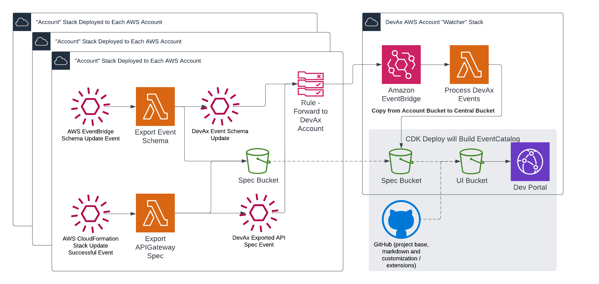

# Supercharging Developer Documentation using EventCatalog, CDK and AWS Events *(the code)*

The articles for this series will be posted on [https://matt.martz.codes/series/edd](https://matt.martz.codes/series/edd) and will go over:

1. [Deploying EventCatalog using CDK](https://matt.martz.codes/using-aws-cdk-to-deploy-eventcatalog)
2. Using CloudFormation events to detect and export API Gateway Open API specs into the EventCatalog
3. Using EventBridge Schema Registry events to export Discovered Event Schemas into EventCatalog

Special thanks to [David Boyne](https://twitter.com/boyney123) for his awesome work on [EventCatalog](https://eventcatalog.dev)

# Instructions

1. `npm install`
2. `npm run deploy`
3. After initial deploy, grab the CDK-generated watcher bucket name and `export SPEC_BUCKET=<watcher bucket name>`
4. Deploy some other projects with API Gateways
5. `npm run deploy` from this point on will pull the specs from the watcher bucket and bundle them into the catalog

Note: if you want to use this you probably want to customize the domain naming scheme and/or remove `acct-*` from `.gitignore`